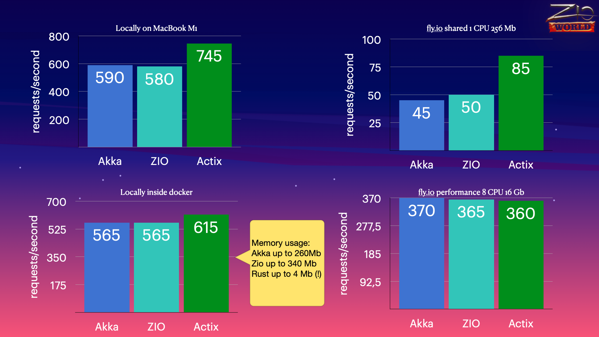

# simple-auth
Simple Authentication Web Service for Performance Comparisons

This project was written to enable performance comparisons for a micro-service 'simple-auth' written in akka-http, ZIO and Actix-web (rust). 
The results were presented on Friday 21st at ZIOWorld conference.

The main performance results are summarized in this image; the full presentation is available in the /docs directory.

## Database
Start postgres database called `db` on port 5435 in docker container `postgres-simple-auth`:
```bash
cd db
./run_db.sh

```

### Run akka-http locally
```bash
cd akka-http
sbt run
```
### Run akka-http in docker
```bash
cd akka-http
./rebuild-img.sh
```
### Run zio locally
```bash
cd zio
sbt run
```
### Run akka-http in docker
```bash
cd zio
./rebuild-img.sh
```
(change .env values)
### Run actix-web locally
```bash
cd actix-web
cargo run
<or>
cargo run --release
```
### Run actix-web in docker
```bash
cd actix-web
docker-compose up
```
(change .env values)

### Invoke /token endpoint
```bash
curl http://localhost:8781/token -X POST -d '{"username":"john@example.com","password":"TopSecret0!"}' -H 'Content-Type: application/json'
```

### Load test
```bash
wrk -s post-token.lua -d60 -t50 -c50 http://localhost:8781/token
```
